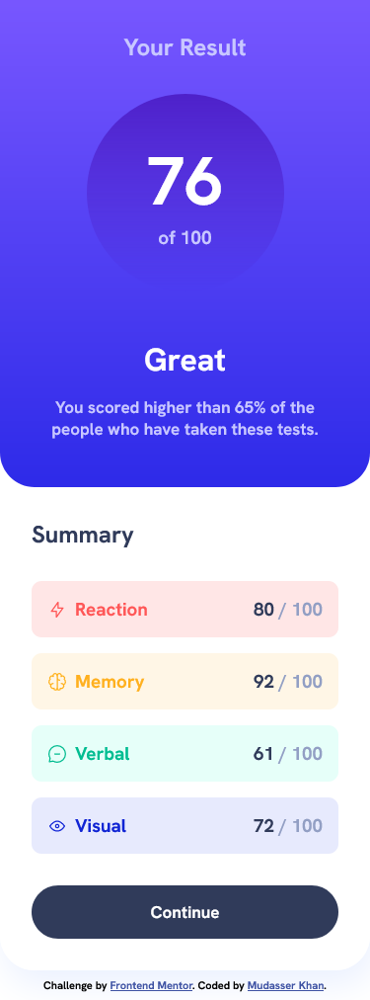

# Frontend Mentor - Results summary component solution

This is a solution to the [Results summary component challenge on Frontend Mentor](https://www.frontendmentor.io/challenges/results-summary-component-CE_K6s0maV). Frontend Mentor challenges help you improve your coding skills by building realistic projects. 

## Table of contents

- [Overview](#overview)
  - [Screenshot](#screenshot)
  - [Links](#links)
- [My process](#my-process)
  - [Built with](#built-with)
- [Author](#author)

## Overview
- It was a lot of work, but worth it, a great challenge,

### Screenshot

### Links
- Solution URL: [Add solution URL here](https://your-solution-url.com)
- Live Site URL: [Add live site URL here](https://your-live-site-url.com)

## My process
  Used Grid for the component and changed it to flex in mobile views.

### Built with

- HTML5 markup
- CSS custom properties
- Flexbox
- CSS Grid
- Mobile-first workflow
- Gradients

 
## Author
- Github - [@mdxr](https://github.com/Mdxr)
- Frontend Mentor - [@mdxr](https://www.frontendmentor.io/profile/mdxr)
- Instagram - [@jsnexus](https://instagram.com/jsnexus)

# Result-Summery-Component
